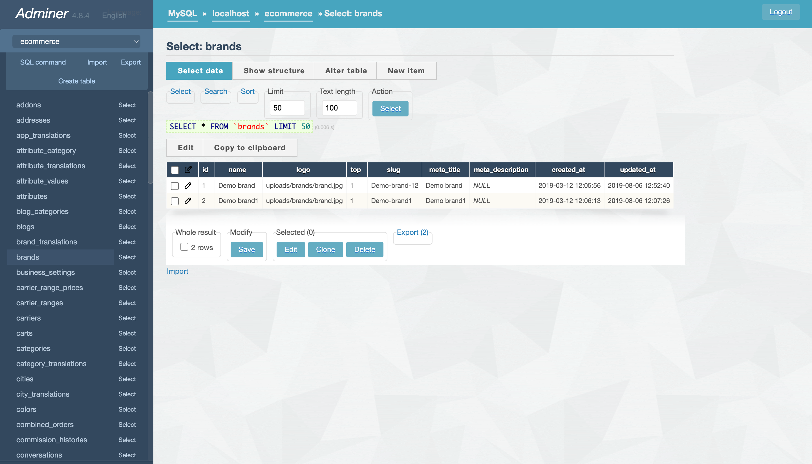

# DB

DB is a adminer database with beautiful theme

## Installation

Just clone this repo and browse from your browser

You can also serve this with php built-in server

```bash
php -S localhost:1000
```

## Usage

Just browse to `localhost:1000` and you will see the adminer login page

## Screenshots


